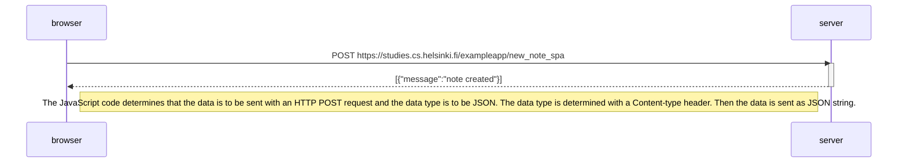

```mermaid
sequenceDiagram
    participant browser
    participant server

    browser->>server: POST https://studies.cs.helsinki.fi/exampleapp/new_note_spa
    activate server
    server-->>browser: [{"message":"note created"}]
    deactivate server

    Note right of browser: The JavaScript code determines that the data is to be sent with an HTTP POST request and the data type is to be JSON. The data type is determined with a Content-type header. Then the data is sent as JSON string.
```